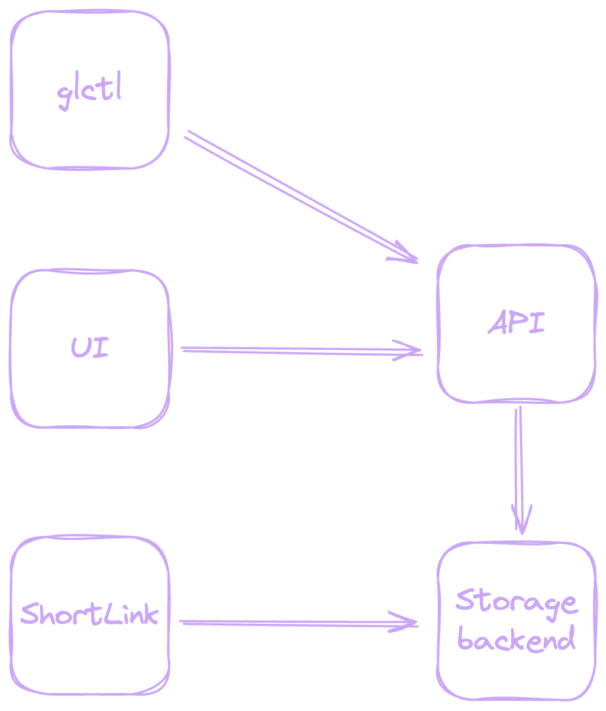
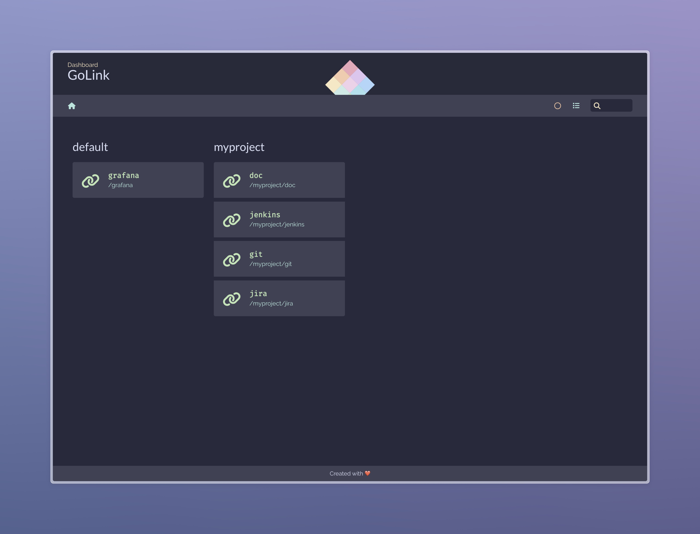

---
hide:
  - toc
---

# Overview

!!! warning  "Project is in early development."

    This project is in early development and is not yet ready for production use.
    You are welcome to try it out and provide feedback, but be aware that the
    API may change at any time.

GoLink is a private shortlink service written in Go. It is designed to be simple to use and easy to deploy. GoLink are intuitive and easy to remember.
A go link is a short keyword that can be entered directly into your browser’s address bar to quickly access a resource. For example, you can create a go link called `go/grafana` that redirects to <https://grafana.example.com> or `go/myproject/git` that redirects to <https://git.example.com/myproject>.

## Features

* Simple and intuitive web interface
* Easy to deploy
* Easy to use
* Short and memorable links
* Redirect to any URL

## Concept

{ width="350", align="left" }

### List of components

* `UI` is a simple web interface that allows users view and filter all available links. UI is written in vue.js and is served by GoLink server.
* `API` is a REST API that allows users to create, update and delete links. API is written in Go and is served by GoLink server.
* `Shortlink` is a short keyword that can be entered directly into your browser’s address bar to quickly access a resource. This is the main concept of GoLink. Is written in Go and is served by GoLink server.
* `glctl` is a command line tool that allows users to create, update and delete links. glctl is written in Go and available for Linux, MacOS and Windows.
* `StorageBackend` is a storage backend that stores all links. GoLink supports actually only Redis as storage backend but in future will be supported more backends.

## Dashboard

## Who’s it for?

GoLink is for anyone who wants to create short, memorable links to internal resources. It’s especially useful for organizations that have a lot of internal services and want to make it easy for employees to access them.
